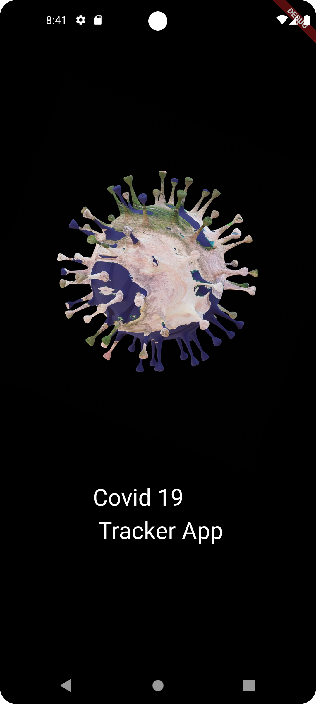
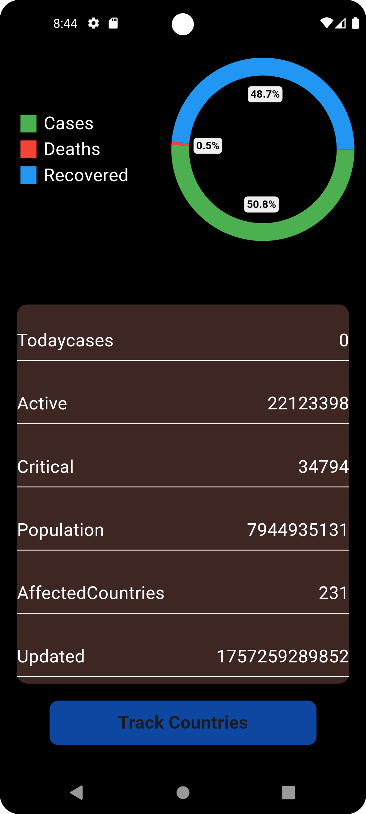
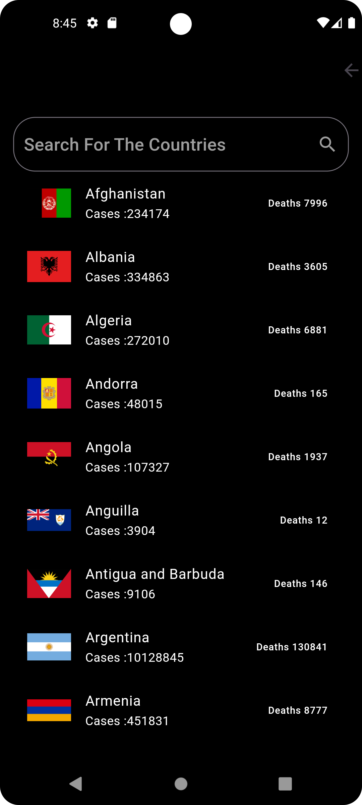
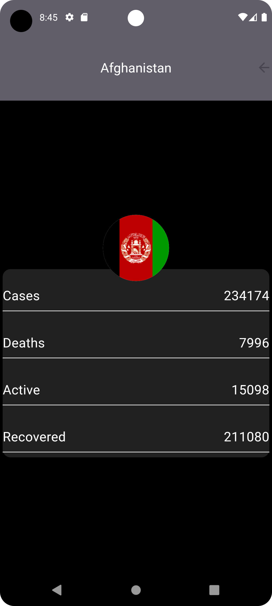

# 🦠 Covid19 Tracker App

[](https://flutter.dev/)
[](https://dart.dev/)
[](https://disease.sh/)

A **COVID-19 Tracker App** built using **Flutter** that fetches real-time Coronavirus statistics from the [disease.sh API](https://disease.sh/v3/covid-19/).  
This app displays **global** and **country-wise** cases, recoveries, and deaths in a clean and simple UI.

---

## 🚀 Features
- 🌍 View **Global COVID-19 Stats**
- 🏳️ **Country-wise Statistics**
- 🔄 Real-time data fetched from API
- 📊 Charts/Graphs for better visualization
- 🎨 User-friendly and responsive UI

---

## 📸 Screenshots
<p align="center">
  
  
  
  

</p>


---

## 🛠️ Tech Stack
- **Frontend:** Flutter, Dart
- **Backend (API):** [disease.sh - Open Disease Data API](https://disease.sh/v3/covid-19/)
- **State Management:** setState

---

## 📦 Installation & Setup

Clone the repository and run the app locally:

```bash
# Clone the repository
git clone https://github.com/your-username/corona-track-app.git

# Navigate to project directory
cd corona-track-app

# Install dependencies
flutter pub get

# Run the app
flutter run
```
---
## 📡 API Reference

All data is fetched from disease.sh API
.

Endpoints used:

🌍 Global Stats → https://disease.sh/v3/covid-19/all

🏳️ Country Stats → https://disease.sh/v3/covid-19/countries/{country}

---
## 📜 License

This project is licensed under the MIT License – feel free to use, modify, and share.

---

## 👨‍💻 Author

Sxjjad Mehmood
🌐 GitHub